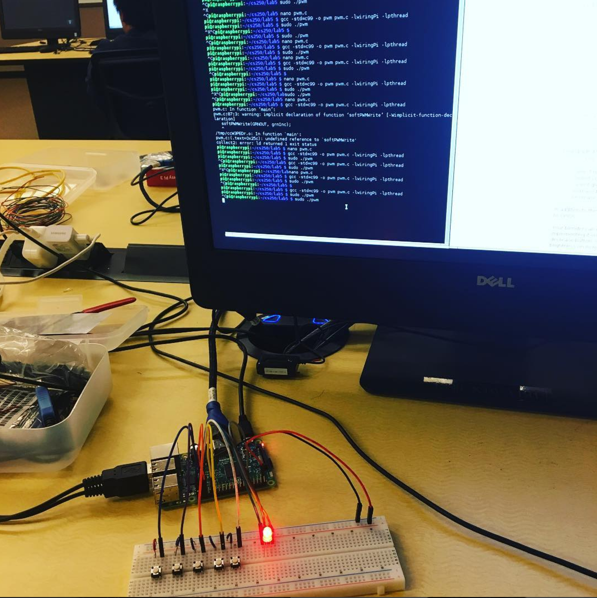

# UrLED

UrLED is a customizable RGY lightbulb that changes color through either user input on the 5 buttons, RedIn, GreenIn, YellowIn, Increment +5, Decrement+5, or through a server that holds different requests pre-determined by the user. The RGY incrementer was programmed in C. The I/O was Linux C, and the database was in C#.NET.
Here is the Final Product:

